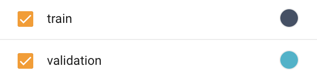
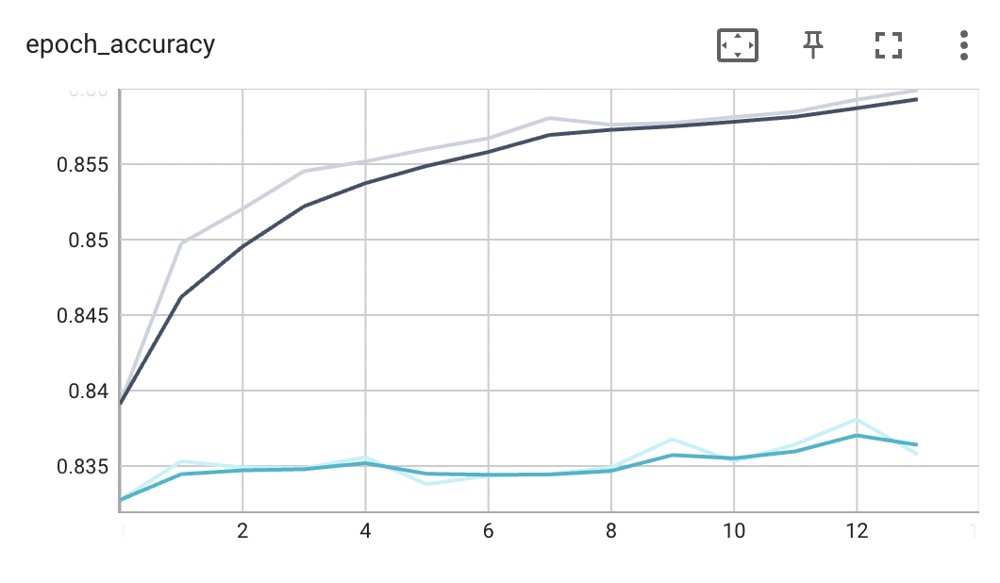
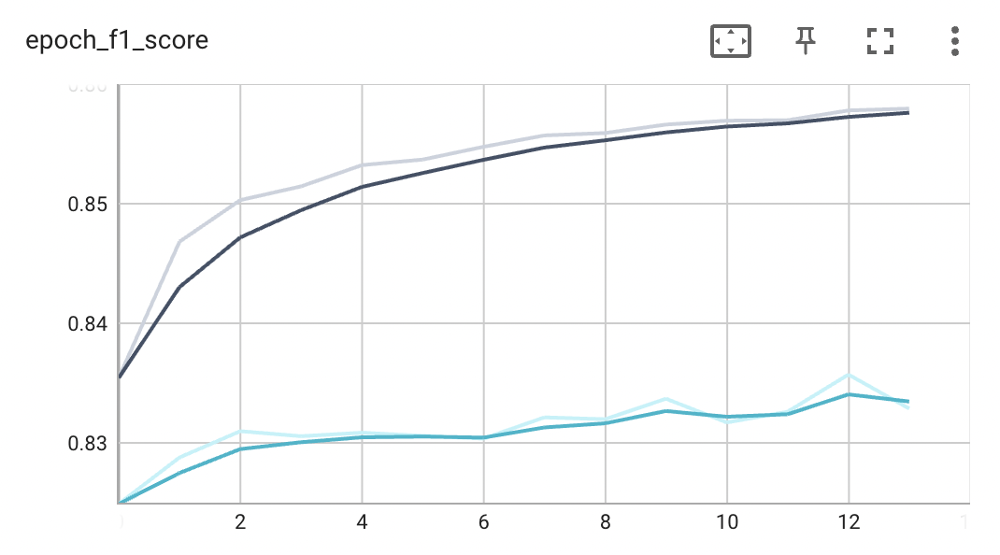

### Approach
In this approach we used a non-sequential model. The model have the following components:
1. Freezed Spacy en_core_web_md word to vector encoder. Outputs 300 length vector representation of word.
2. Dense Neural network with two hidden layer and dropout. 
   - Input length 300
   - Hidden layer one 128
   - Hidden layer two 64
   - Output length 3

#### Overall score
| Dataset        | Accuracy | F1 Score |
|----------------|----------|----------|
| Train Set      | 0.8593   | 0.8579   | 
| Validation Set | 0.8358   | 0.8685   | 
| Test Set       | 0.8392   | 0.9547   | 

### Instruction
Run the ```src/main.ipynb``` sequentially to reproduce the result.

### Training graphs

1. Epoch / Accuracy

2. Epoch / F1 Score



| Dependencies     |
|------------------|
| [gensim][GENSIM] |
| [spacy][SPACY]   |
| [numpy][NP]      |
| [keras][KERAS]   |
| [tensorflow][TF] |

[GENSIM]: <https://radimrehurek.com/gensim/>
[SPACY]: <https://spacy.io/>
[NP]: <https://numpy.org/>
[KERAS]: <https://keras.io/>
[TF]: <https://www.tensorflow.org/>
