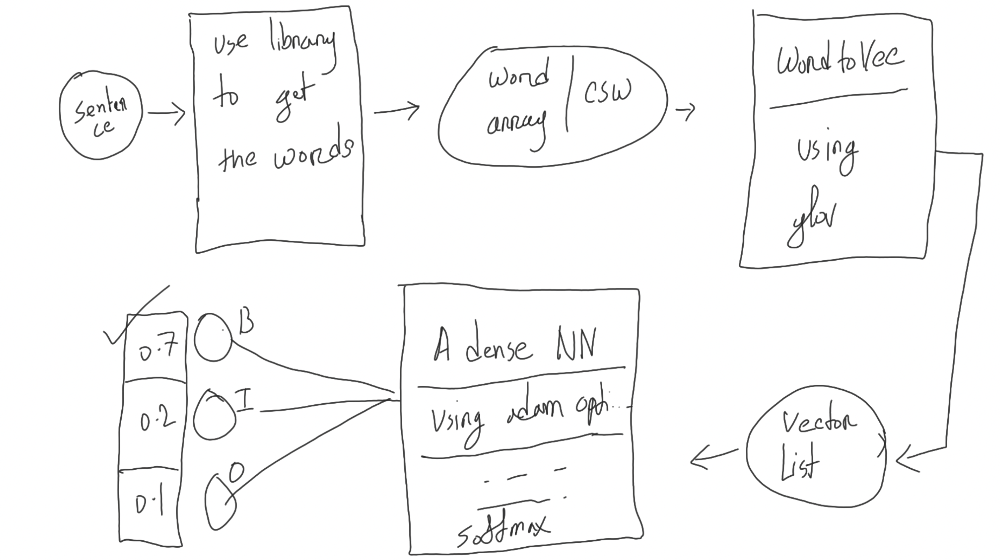

### An example project for named entity recognition(NER)

### Territory

1. Scratch Dense NN (Tensorflow + keras) 10/04/23
2. Spacy 12/04/23
3. Long Short Term Memory (Pytorch + lightening)
4. Scratch Transformer (Pytorch)
5. GPT + fine-tuning (Hugging-face)
6. Bert + fine-tuning (Hugging-face)

- Server using Next.js & React. 

HuggingFace (Transformer specialist)