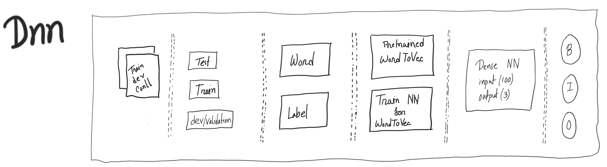
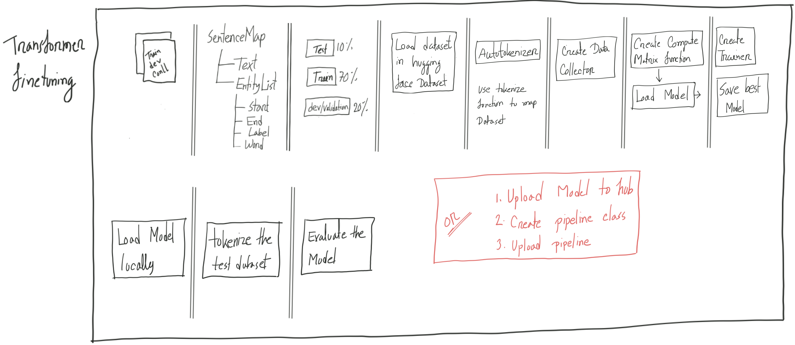

## An example project for named entity recognition(NER)

### Approaches
1. Scratch Dense NN (Tensorflow + keras)

2. Long Short Term Memory (Pytorch + lightening)

3. Spacy

4. Scratch Transformer (Pytorch)

5. Transformer Fine Tuning (Hugging Face)

### Result
Detail result analysis is available in each project directory.

We couldn't complete the following approaches due to time constraints
  - 2.Long Short Term Memory (Pytorch + lightening)
  - 4.Scratch Transformer (Pytorch)

For the other three approach the summery of the results are given below.

#### Dense Neural Network Model Overall score
| Dataset        | Accuracy | F1 Score |
|----------------|----------|----------|
| Train Set      | 0.8593   | 0.8579   | 
| Validation Set | 0.8358   | 0.8685   | 
| Test Set       | 0.8392   | 0.9547   | 

#### Spacy Transition-based Parser Model Overall score
| Dataset           | F1 Score   | Precision   | Recall     |
|-------------------|------------|-------------|------------|
| Validation Set    | 0.8554     | 0.8685      | 0.8426     |
| Test Set          | 0.8658     | 0.8810      | 0.8510     |

#### DistilBERT Fine-tuning Model Overall Scores
| Dataset   | F1 Score | Precision | Recall | Accuracy |
|-----------|----------|-----------|--------|----------|
| Train Set | 0.5844   | 0.5833    | 0.5856 | 0.8844   |

### Project File Structure

- Each approach have a directory associated with it
- These directories are python project themselves
- They have the following file structure
  - src directory (Contain all source code)
    - main.py (Starting point of the project)
  - explore.ipynb (Contain some exploratory code specific to that project)
  - requirements.txt (Contain the requirement of that project)
  - readme.md (Contain any specific command or note regarding that project)

### Upcoming
The purpose of the server directory is to enable easy inference of all projects by serving them in a centralized location

### Contribution
Thank you for considering contributing to our project! We appreciate your time and effort.

To start contributing, follow these steps:
1. Fork the repository and clone your fork.
2. Create an issue in the repository or choose an existing one.
3. Create a new branch for your changes (use a descriptive name with the issue name, such as #2-add-new-feature, #3-add-new-approach).
4. Make your changes in the new branch.
5. Test your changes thoroughly.
6. Commit and push your changes to your fork.
7. Use the issue number like #2, #3 ... in your commit message
8. Create a pull request.
