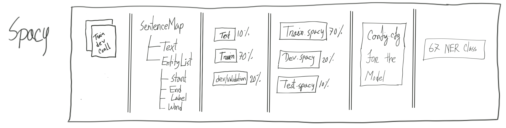
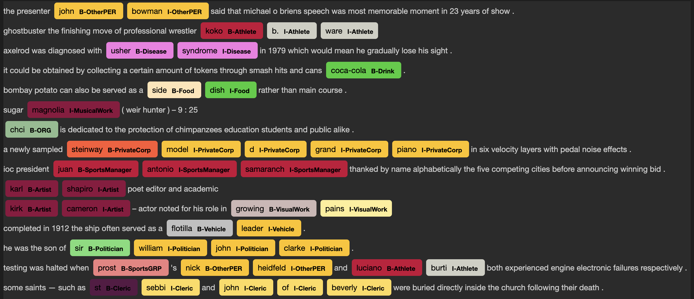
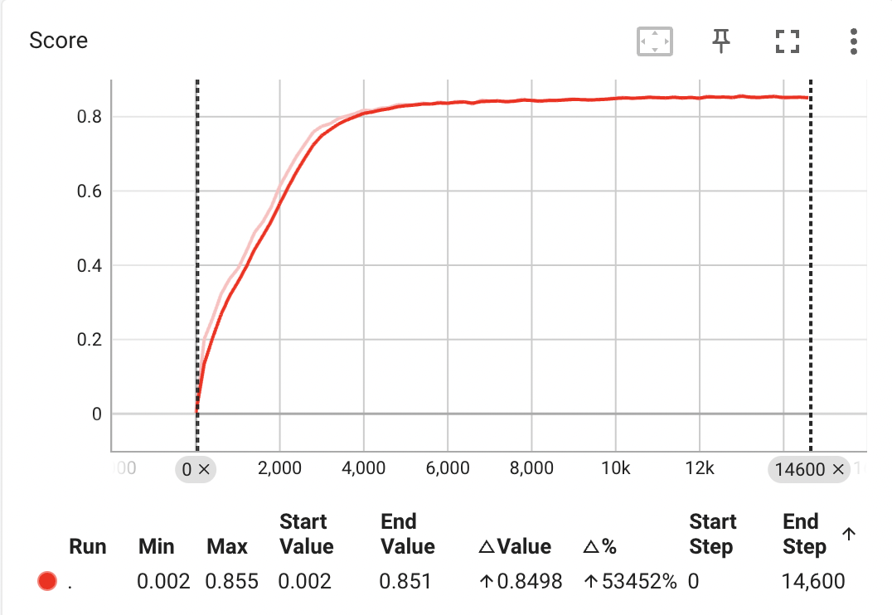
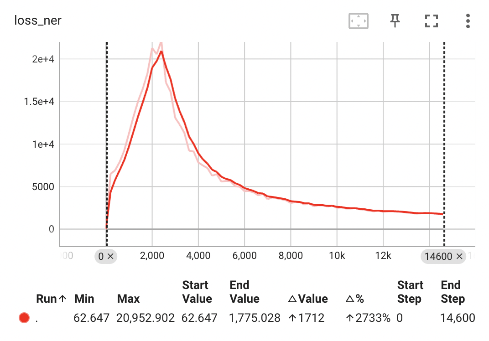
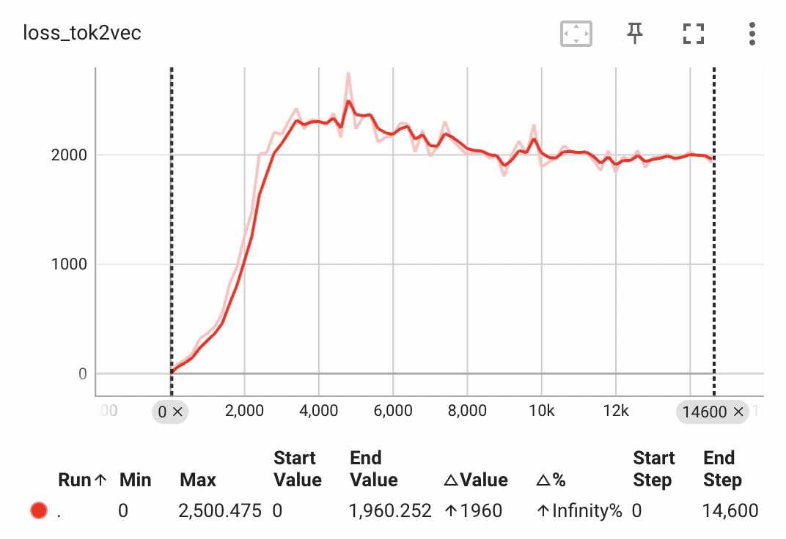
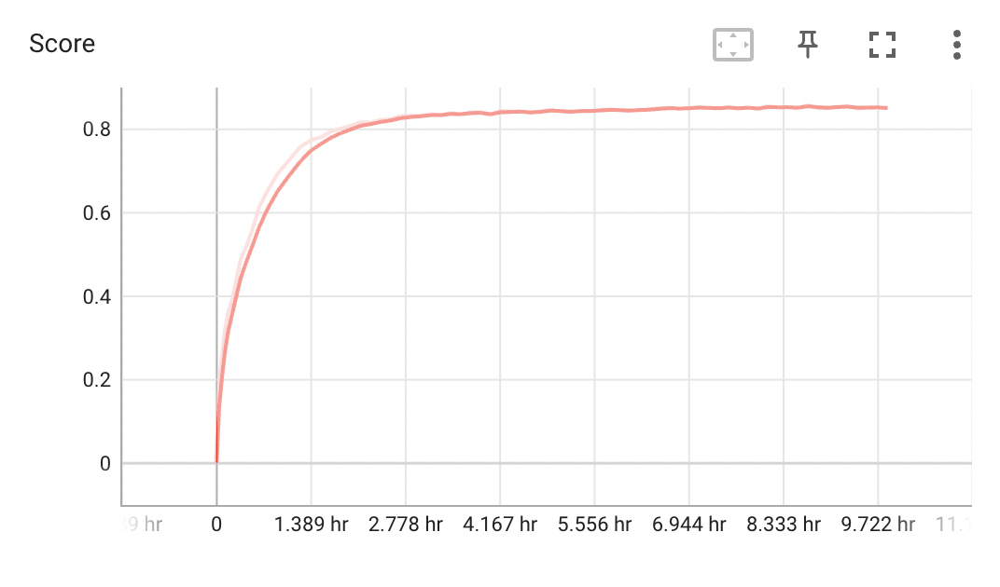

### Overview


### Result

#### Overall score
| Dataset           | F1 Score   | Precision   | Recall     |
|-------------------|------------|-------------|------------|
| Validation Set    | 0.8554     | 0.8685      | 0.8426     |
| Test Set          | 0.8658     | 0.8810      | 0.8510     |

#### Evaluation result per type
| Entity Type             | Precision | Recall | F1-Score |
|-------------------------|-----------|--------|----------|
| B-Artist                | 87.44     | 88.57  | 88.00    |
| I-Artist                | 87.29     | 88.26  | 87.77    |
| B-AnatomicalStructure   | 93.75     | 80.36  | 86.54    |
| I-WrittenWork           | 90.06     | 90.57  | 90.31    |
| B-WrittenWork           | 84.82     | 84.38  | 84.60    |
| I-ORG                   | 92.55     | 90.51  | 91.52    |
| B-ORG                   | 86.29     | 86.58  | 86.43    |
| B-Symptom               | 80.00     | 90.32  | 84.85    |
| I-Symptom               | 89.47     | 85.00  | 87.18    |
| B-Cleric                | 85.11     | 80.00  | 82.47    |
| I-Cleric                | 87.10     | 79.41  | 83.08    |
| B-VisualWork            | 90.10     | 77.45  | 83.30    |
| I-VisualWork            | 85.51     | 83.10  | 84.29    |
| B-Facility              | 91.12     | 83.69  | 87.25    |
| I-Facility              | 90.80     | 83.38  | 86.93    |
| B-Disease               | 81.33     | 88.41  | 84.72    |
| I-Disease               | 93.88     | 90.20  | 92.00    |
| B-OtherPER              | 87.11     | 82.28  | 84.63    |
| I-OtherPER              | 86.18     | 79.74  | 82.83    |
| B-HumanSettlement       | 92.15     | 93.40  | 92.77    |
| I-HumanSettlement       | 96.08     | 97.61  | 96.84    |
| B-PublicCorp            | 84.81     | 85.90  | 85.35    |
| B-Vehicle               | 81.08     | 81.08  | 81.08    |
| B-CarManufacturer       | 94.12     | 64.00  | 76.19    |
| I-OtherPROD             | 84.62     | 81.91  | 83.24    |
| B-OtherPROD             | 91.41     | 82.98  | 86.99    |
| B-Politician            | 77.39     | 84.62  | 80.84    |
| I-Politician            | 72.31     | 84.68  | 78.01    |
| B-MusicalGRP            | 93.98     | 78.62  | 85.62    |
| B-Scientist             | 84.85     | 75.68  | 80.00    |
| I-Scientist             | 84.62     | 74.16  | 79.04    |
| B-Athlete               | 85.71     | 87.33  | 86.52    |
| I-Athlete               | 87.03     | 84.96  | 85.98    |
| I-CarManufacturer       | 86.96     | 90.91  | 88.89    |
| I-PublicCorp            | 95.45     | 89.36  | 92.31    |
| B-MusicalWork           | 90.68     | 82.95  | 86.65    |
| I-MusicalWork           | 92.66     | 88.86  | 90.72    |
| B-SportsGRP             | 91.72     | 80.61  | 85.81    |
| I-SportsGRP             | 96.46     | 82.68  | 89.04    |
| B-SportsManager         | 93.10     | 77.14  | 84.38    |
| I-SportsManager         | 95.08     | 80.56  | 87.22    |
| B-Clothing              | 82.05     | 96.97  | 88.89    |
| B-AerospaceManufacturer | 92.86     | 81.25  | 86.67    |
| B-Software              | 81.18     | 77.53  | 79.31    |
| I-Software              | 82.83     | 71.30  | 76.64    |
| B-Medication/Vaccine    | 83.13     | 89.61  | 86.25    |
| B-PrivateCorp           | 100.00    | 84.62  | 91.67    |
| I-MusicalGRP            | 91.39     | 81.18  | 85.98    |
| B-OtherLOC              | 81.54     | 77.94  | 79.70    |
| I-OtherLOC              | 85.19     | 77.31  | 81.06    |
| B-Station               | 82.89     | 88.73  | 85.71    |
| I-Station               | 89.42     | 94.90  | 92.08    |
| I-ArtWork               | 96.43     | 69.23  | 80.60    |
| B-ArtWork               | 96.43     | 75.00  | 84.37    |
| I-AerospaceManufacturer | 93.33     | 96.55  | 94.92    |
| B-Food                  | 91.53     | 66.67  | 77.14    |
| I-AnatomicalStructure   | 94.12     | 94.12  | 94.12    |
| I-PrivateCorp           | 100.00    | 94.29  | 97.06    |
| B-MedicalProcedure      | 77.50     | 73.81  | 75.61    |
| I-Vehicle               | 84.62     | 75.86  | 80.00    |
| I-Medication/Vaccine    | 78.95     | 100.00 | 88.24    |
| I-Food                  | 83.33     | 71.43  | 76.92    |
| I-Clothing              | 89.47     | 100.00 | 94.44    |
| B-Drink                 | 92.86     | 90.70  | 91.76    |
| I-MedicalProcedure      | 71.43     | 90.91  | 80.00    |
| I-Drink                 | 88.24     | 100.00 | 93.75    |

F1 Score count based on condition

| Entity List                                                                                                          | F1-Score Condition  | Count |
|----------------------------------------------------------------------------------------------------------------------|---------------------|-------|
| * all other                                                                                                          | F1-Score >= 80      | 58    |
| B-CarManufacturer, I-Politician, I-Scientist, B-Software, I-Software, B-OtherLOC, B-Food, I-Food, B-MedicalProcedure | 75 <= F1-Score < 80 | 9     |

#### Display


### Directory Structure

- Entrypoint for the project is in src/main.py
- Models are not uploaded to git
- Evaluation against test dataset metrics are saved in output/evaluate.json file
- Train log is saved in log/log.tab file
- Tensorboard log directory is log/tensorboard
- Train, Validation and Test dataset is available in data directory
- Config for training can be found in config directory.

### Instruction

#### For creating dataset execute below snippet
```python
from spacy_dataset import SpacyDataset
CreateSpacyDataset()
```

#### For training the model execute below snippet
```python
from train import Train
Train().startTraining(isResumed=False)
```

#### For evaluating the trained model execute below snippet
```python
from inference import Inference
Inference().evaluateTestDataset(None)
```

### Training graphs
1. Score

2. Loss-NER

3. Loss-Tok2Vec

4. Score with respect to time


| Dependencies                 |
|------------------------------|
| [numpy][NP]                  |
| [tensorflow-macos][TF-MC]    |
| [tensorflow-metal][TF-M]     |
| [tensorboard][TB]            |
| [black][B]                   |
| [matplotlib][PLT]            |
| [spacy][SPY]                 |


[NP]: <https://numpy.org/>
[TF-MC]: <https://pypi.org/project/tensorflow-macos/>
[TF-M]: <https://pypi.org/project/tensorflow-metal/>
[TB]: <https://www.tensorflow.org/tensorboard>
[B]: <https://black.readthedocs.io/en/stable/>
[PLT]: <https://matplotlib.org/>
[SPY]: <https://spacy.io/>