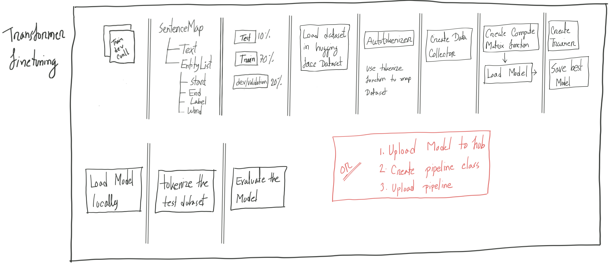
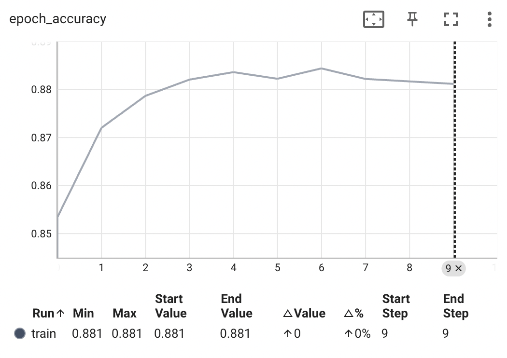
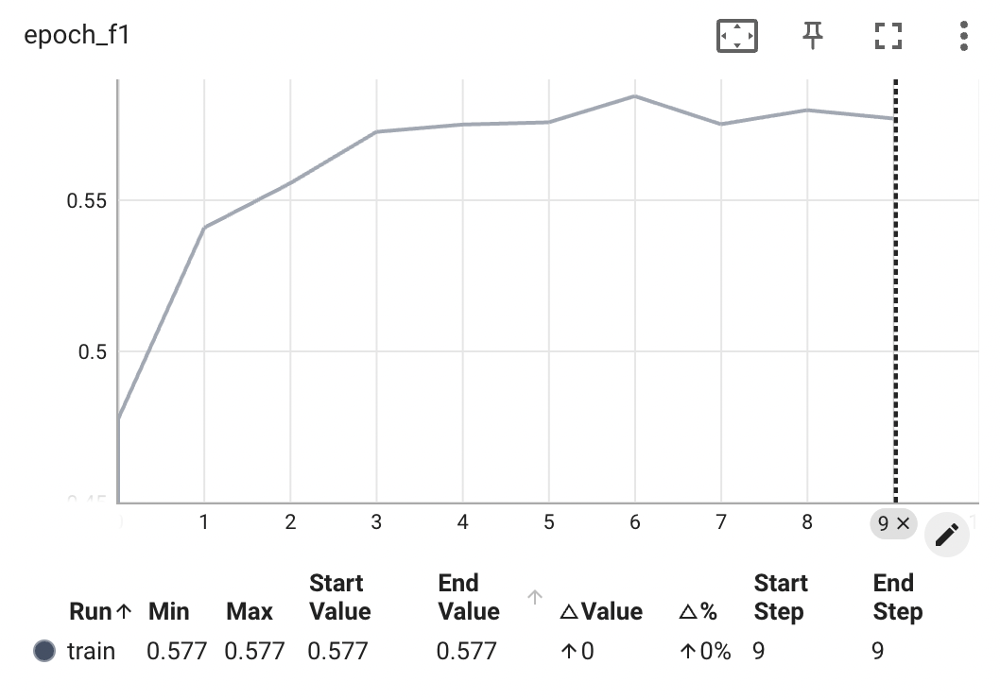

### Result
We tried DistilBERT architecture but the result isn't that satisfactory even on the training dataset.

#### Scores
| Dataset   | F1 Score | Precision | Recall | Accuracy |
|-----------|----------|-----------|--------|----------|
| Train Set | 0.5844   | 0.5833    | 0.5856 | 0.8844   |

Let's explore why the result isn't that great. Let's try to analyse some example.

1. Prediction ['O', 'O', 'O', 'O', 'B-OtherPROD', 'O', 'O', 'O', 'O', 'O', 'O', 'O', 'O', 'O', 'O', 'O', 'O', 'B-Symptom', 'O'] \
   Label ['O', 'O', 'O', 'O', 'O', 'O', 'O', 'O', 'O', 'O', 'O', 'O', 'O', 'O', 'O', 'O', 'O', 'B-Symptom', 'O']
   
    ``` Here we can see our Model is anylysing and predicting based on it's prior knowledge without specificly trained to do so in the finetuning step.```

2. Prediction  ['O', 'O', 'O', 'O', 'O', 'O', 'O', 'O', 'O', 'O', 'B-HumanSettlement', 'B-HumanSettlement', 'O'] \
   Label ['O', 'O', 'O', 'O', 'O', 'O', 'O', 'B-HumanSettlement', 'O', 'O', 'O', 'O', 'O']

    ``` Here our model is just predicting the wrong token as Named entity. ```

3. Prediction ['O', 'O', 'O', 'O', 'B-MusicalGRP', 'I-MusicalGRP', 'O'] \
   Label ['O', 'O', 'O', 'O', 'B-MusicalGRP', 'O', 'B-MusicalGRP']

    ``` In this example our model is again pridecting the wrong token as Named Entity. ```

4. Prediction ['O', 'O', 'O', 'O', 'O', 'O', 'O', 'O', 'O', 'O', 'O', 'O', 'O', 'O', 'O', 'B-OtherPROD', 'B-OtherPROD', 'B-OtherPROD', 'O'] \
   Label ['O', 'O', 'O', 'O', 'O', 'O', 'O', 'O', 'O', 'O', 'O', 'O', 'O', 'O', 'O', 'B-Software', 'B-Software', 'B-Software', 'O']

    ``` In this example our model is assuming different Named entity based on it's prior knowledge. ```

5. Prediction ['O', 'O', 'O', 'O', 'B-ORG', 'I-ORG', 'I-ORG', 'I-ORG', 'I-ORG', 'O', 'O', 'O'] \
   Label ['O', 'O', 'O', 'I-ORG', 'B-ORG', 'I-ORG', 'I-ORG', 'I-ORG', 'I-ORG', 'O', 'O', 'O']

    ``` In this example our data label is wrong but our model is predicting correct tag for word. ```

**So overall we can say the model architecture is too complex for this job and the prior knowledge found in the pre-training step is dominating over our fine-tuning training step**

### Instruction

#### For creating the label classification info of given data
```python
from src.preprocess import PreProcess
PreProcess.saveLabelInfo("../data/label_info.json")
```

#### For preprocessing the given data as DistilBERT input
```python
from src.preprocess import PreProcess
PreProcess.saveRawDataInJson("../data/all_data.json", "../data/label_info.json")
```

#### For starting the training loop
```python
from src.train import Train
Train.startTraining()
```

### Training graphs
1. Epoch / Accuracy

2. Epoch / F1 Score


| Dependencies              |
|---------------------------|
| [numpy][NP]               |
| [tensorflow-macos][TF-MC] |
| [tensorflow-metal][TF-M]  |
| [tensorboard][TB]         |
| [black][B]                |
| [matplotlib][PLT]         |
| [transformers][TR]        |
| [torch][TOR]              |

[NP]: <https://numpy.org/>
[TF-MC]: <https://pypi.org/project/tensorflow-macos/>
[TF-M]: <https://pypi.org/project/tensorflow-metal/>
[TB]: <https://www.tensorflow.org/tensorboard>
[B]: <https://black.readthedocs.io/en/stable/>
[PLT]: <https://matplotlib.org/>
[TR]: <https://huggingface.co/docs/transformers/index/>
[TOR]: <https://pytorch.org/>
